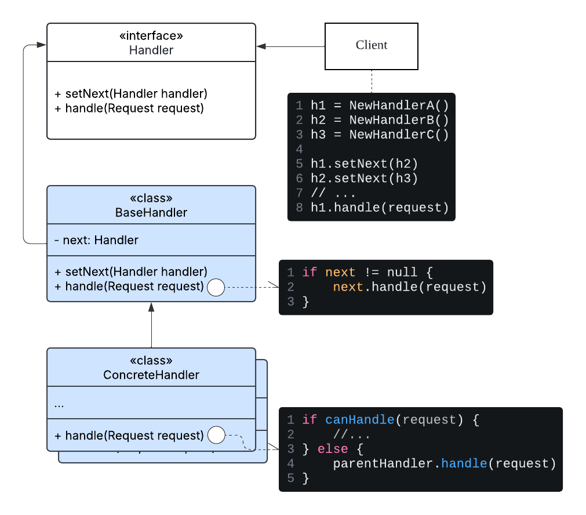

# Chain of Responsibility Design Pattern

## 책임 연쇄 패턴(Chain of Responsibility Design Pattern)이란?

- 객체가 요청을 핸들러(handler)의 체인을 따라 전달할 수 있게 해주는 행동/행위(behavioral) 디자인 패턴
- 이 패턴은 여러 객체로 이뤄진 체인에서 자주 사용됨
    - 체인의 각 개체는 자신이 요청을 처리하거나, 처리할 수 없는 경우 요청을 체인의 다음 객체에게 전달함
- 이 패턴은 송신자와 수신자 간의 느슨한 결합을 촉진하여, 요청을 처리하는 데 있어 유연성을 제공함

### 책임 연쇄 패턴의 특징

- 느슨한 결합(Loose Coupling)
    - 요청을 보내는 객체가 어떤 특정 객체가 이를 처리할지 알 필요가 없음을 의미함
    - 마찬가지로 핸들러 역시 요청이 어떻게 전송되었는지 이해할 필요가 없음
    - 이로 인해 컴포넌트들을 분리하고, 유연하게 유지할 수 있게 해줌
- 동적 체인(Dynamic Chain)
    - 프로그램이 실행되는 동안 체인을 변경하는 것이 간단함을 의미함
    - 메인 코드 본문을 변경하지 않고도 handler들을 추가하거나 삭제할 수 있음
- 단일 책임 원칙(Single Responsibility Principle)
    - 체인의 각 핸들러는 요청을 처리하거나 다음 처리자에게 전달하는 단 하나의 임무를 가짐을 의미함
    - 이로 인해 코드의 유지보수성을 높임
- 순차적 순서(Sequential Order)
    - 요청은 체인을 따라 한 번에 하나씩 순차적으로 이동함을 의미함
    - 각 핸들러는 특정 순서로 요청을 처리할 기회를 얻으며, 일관성을 보장함
- 대비책 메커니즘(Fallback Mechanism)
    - 요청이 어떤 처리자에 의해서도 처리되지 않을 경우, 체인은 fallback option을 포함할 수 있음을 의미함
    - 이는 어떤 handler에도 해당하지 않는 요청을 처리할 기본 방식이 있음을 의미함

## Chain of Responsibility Design Pattern 구현

### Components

- Handler Interface or Abstract Class
    - 모든 Concrete Handler에 공통적인 인터페이스
    - 일반적으로 요청을 처리하기 위한 메서드와 체인의 다음 핸들러를 세팅하기 위한 메서드가 있음
- Base Handler(Optional)
    - 선택적인 클래스이며, 모든 Concrete Handler에 공통적인 상용구 코드(boilerplate cde)를 넣을 수 있음
    - 일반적으로 다음 핸들러에 대한 참조를 저장하기 위한 필드를 정의함
- Concrete Handler
    - 요청을 처리하기 위한 실제 코드가 포함된 핸들러
    - 이 핸들러에서는 실제 요청을 처리하거나, 다음 핸들러에게 요청을 전달함
    - 일반적으로 독립적(self-contained)이며, 불변(immutable)해 생성자를 통해 필요한 모든 데이터를 한 번만 받음
- Client
    - 애플리케이션의 로직에 따라 체인을 한 번만 구성하거나 동적으로 구성할 수 있는 객체
    - 요청은 체인의 모든 핸들러에 보낼 수 있음(꼭 첫 번째 핸들러일 필요는 없음)

### 구현방법

#### 1단계: 핸들러 인터페이스 정의(Define the Handler Interface)

- 인터페이스나 추상 클래스를 활용하여 다음 두 가지 메서드를 정의함
    - 다음 핸들러를 설정하는 메서드
    - 요청을 처리하는 메서드
- 가장 유연한 방법은 요청을 객체로 변환하여 처리 메서드에 인수로 전달하는 방법임

#### 2단계: 구체적인 핸들러 작성(Create Concrete Handlers)

- 1단계에서 정의한 핸들러 인터페이스를 구현함
- 각 Concrete Handler 클래스는 특정 요청을 처리하는 비즈니스 로직을 가짐
- 자신이 처리할 수 없는 요청은 체인의 다음 핸들러에게 전달하도록 구현함

#### 3단계: 체인 설정(Set up Chain)

- Concrete Handler들의 인스턴스를 생성함
- 각 핸들러의 다음 핸들러를 설정하는 메서드를 사용해 핸들러들을 연결함
- 클라이언트는 자체적으로 체인을 조립하거나, 다른 객체들로부터 미리 구축된 체인을 받을 수 있음
    - 후자의 경우, 체인을 구축하기 위한 일부 Factory Class를 구현해야 함

#### 4단계: 요청 전송(Send Requests)

- 클라이언트가 첫 번째 혹은 모든 핸들러를 사용하여 요청을 보냄
    - 주로 첫 번째 핸들러로 요청을 보냄
    - 이렇게 하면 체인의 각 핸들러가 요청을 처리할지 아니면 다음 핸들러에게 전달할지 결정할 수 있음

### 예시
[다음 페이지에 구현](./example/EXAMPLE.md)

## 장단점

### 장점

- 요청의 처리 순서를 제어할 수 있음
- 개방/폐쇄 원칙(Open/Closed Principle)을 지켜 클라이언트 코드에 영향을 주지 않고, 새로운 핸들러를 쉽게 추가/삭제 및 기존 핸들러 수정이 가능함
    - 유연성과 확장성 증진
- 단일 책임 원칙(Single Responsibility Principle)을 지켜 작업을 호출하는 클래스와 작업을 수행하는 클래스를 분리할 수 있음
- 요청을 처리하는 순서와 순열을 런타임에 동적으로 변경할 수 있어, 요구 사항에 따라 처리 로직을 조정할 수 있음
- 송신자는 처리 로직을 알 필요가 없어, 송신 객체와 수신 객체 간의 상호작용을 단순화함

### 단점

- 체인이 올바르게 구현되지 않으면, 일부 요청이 전혀 처리되지 않고 넘어갈 수 있음
    - 애플리케이션에 예기치 않은 동작을 유발할 수 있음
- 요청이 길고 복잡한 체인을 통과해야 한다면, 성능 오버헤드를 발생시킬 수 있음
    - 각 핸들러의 처리 로직은 시스템의 전반적인 성능에 영향을 미침
- 요청이 여러 핸들러를 거치기 때문에 디버깅이 더 어려워질 수 있음
- 체인이 런타임에 동적으로 수정되는 경우, 체인을 관리하고 유지보수하는 것이 복잡해질 수 있음

## References
- https://refactoring.guru/design-patterns/chain-of-responsibility
- https://www.geeksforgeeks.org/system-design/chain-responsibility-design-pattern/
