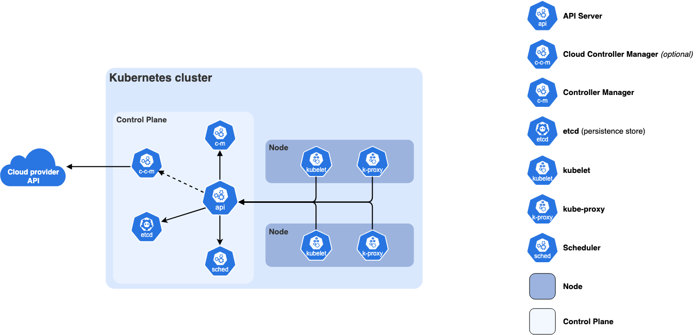

# Kubernetes Overview

## Introduction

학부생 때 클라우드 연구실의 학부 연구생으로 활동했던 적이 있습니다. 덕분에 얕게나마도 쿠버네티스에 대해 공부하고, 설치 및 사용해 본 경험이 있습니다. 하지만 그때 당시 쿠버네티스 클러스터를 구축하고, 서비스를 배포하면서 너무나 삽질을 많이 해 고생했던 기억이 있습니다. 이러한 아픈 기억으로 인해 쿠버네티스라면 학을 떼고, DevOps 직무는 저랑 안 맞는 직무라 단정지었습니다. 그러나 실무에서는 싫다고 안 하면, 그만큼 일할 때 제약이 많음을 몸소 경험했습니다. 

그래서 이제라도 쿠버네티스에 대해 제대로 공부해보려 합니다. 그동안 야매(?)로 버티던 나날에서 벗어나기 위해, 좀 더 자유롭고 많은 개발을 하기 위해서라도 공부하려 합니다. 이 문서들은 CKA와 CKAD 자격증 취득을 최종 목표로 공부하며 남긴 기록물입니다.

## Kubernetes란?

- 쿠버네티스는 컨테이너화된 워크로드와 서비스를 관리하기 위한 이식성이 높고, 확장 가능한 오픈소스 컨테이너 오케스트레이션 플랫폼으로 선언적 구성과 자동화를 모두 용이하게 해 줌

## Kubernetes를 사용하는 이유

프로덕션 환경에서는 컨테이너화된 애플리케이션을 관리하고, 다운타임이 발생하지 않도록 보장해야 함. 이 때 쿠버네티스는 분산 시스템을 탄력적으로 실행할 수 있는 프레임워크를 제공함으로써 위 요구사항을 충족해 줌. 즉, 쿠버네티스를 통해 애플리케이션의 확장과 장애 조치를 관리하고, 다양한 배포 패턴 등을 지원할 수 있음.

쿠버네티스는 다음과 같은 구체적인 기능을 지원함:

### 서비스 디스커버리와 로드 밸런싱 (Service discovery and load balancing)

- 쿠버네티스는 DNS 이름을 사용하거나 자체 IP 사용하여 컨테이너를 노출할 수 있음
- 특정 컨테이너에 트래픽이 몰릴 경우, 쿠버네티스는 네트워크 트래픽을 로드 밸런싱하고 배포하여 서비스가 안정적으로 유지되도록 함

### 스토리지 오케스트레이션 (Storage orchestration)

- 로컬 저장소, 공용 클라우드 공급자 등 사용자가 원하는 스토리지 시스템을 자동으로 마운트할 수 있도록 지원함

### 자동화된 롤아웃과 롤백 (Automated rollouts and rollbacks)

- 쿠버네티스를 사용하면 배포된 컨테이너의 `원하는 상태(desired state)`를 정의할 수 있음 
    - 현재 상태를 원하는 상태로 설정한 속도에 맞춰 변경할 수 있음
    - 예를 들어, 쿠버네티스를 자동화하여 배포용 새 컨테이너를 만들고, 기존 컨테이너를 제거하고, 모든 리소스를 새 컨테이너에 적용할 수 있음

### 자동화된 빈 패킹 (Automatic bin packing)

- 컨테이너화된 작업을 실행하는데 사용할 수 있는 쿠버네티스 클러스터 노드를 제공함
- 각 컨테이너에 필요한 CPU와 메모리(RAM) 사양을 설정하면, 쿠버네티스가 리소스를 가장 효율적으로 사용할 수 있도록 컨테이너를 노드에 배치함

### 자동화된 복구 (Self-healing)

- 쿠버네티스는 실패한 컨테이너를 다시 시작하고, 쿄체하며, `사용자 정의 상태 검사
(Health check)`에 응답하지 않는 컨테이너를 제거함
- 서비스 준비가 완료될 때까지 그러한 과정을 클라이언트에게 보여주지 않음

### 시크릿과 구성 관리 (Secret and configuration management)

- 쿠버네티스를 사용하면 암호, OAuth 토큰 및 SSH 키와 같은 중요한 정보를 저장하고 관리할 수 있음
- 컨테이너 이미지를 재구성하지 않고, 스택 구서에 시크릿을 노출하지 않고도 시크릿 및 애플리케이션 구성을 배포 및 업데이트할 수 있음

### 배치 실행 (Batch execution)

- 서비스 외에도, 쿠버네티스는 배치 및 CI 워크로드를 관리할 수 있음
- 필요한 경우 실패한 컨테이너를 교체할 수 있음

### 수평 확장 (Horizontal scaling)

- 간단한 명령어, UI, 또는 CPU 사용량에 따라 자동으로 애플리케이션을 확장하거나 축소할 수 있음

### IPv4/IPv6 이중 스택 (IPv4/IPv6 dual-stack)

- 파드(Pod)와 서비스에 IPv4 및 IPv6 주소를 할당할 수 있음

### 확장성성을 고려한 설계 (Designed for extensibility)

- 업스트림 소스 코드를 수정하지 않고도, 쿠버네티스 클러스터에 새로운 기능을 추가할 수 있음

## Kubernetes 컴포넌트

### 핵심 컴포넌트

쿠버네티스 클러스터는 컨트롤 플레인과 하나 이상의 워커 노드로 구성됨.

#### Control Plane Components

쿠버네티스 클러스터의 전반적인 상태를 관리함

- kube-apiserver
    - 쿠버네티스의 HTTP API를 노출하는 핵심 서버 컴포넌트
- etcd
    - 모든 API 서버 데이터를 위한 일관성과 고가용성을 갖춘 키-값 저장소
- kube-scheduler
    - 아직 노드에 할당되지 않은 파드를 찾아 적절한 노드에 할당함
- kube-controller-manager
    - 쿠버네티스 API의 동작을 실제로 구현하는 컨트롤러들을 실행함
- cloud-controller-manager (optional)
    - 기저의 클라우드 프로바이더(AWS, Azure, GCP 등)와 연동 기능을 제공함

#### Node Components

모든 노드에서 실행되며, 실행 중인 파드를 유지하고 쿠버네티스 런타임 환경을 제공함

- kubelet
    - 컨테이너를 포함한 파드들이 정상적으로 실행되고 있는지를 확인하고 관리함
- kube-proxy
    - 노드 상의 네트워크 규칙을 유지 관리하여 쿠버네티스 서비스(Service)를 구현함
    - 서비스 통신을 가능하게 함
- 컨테이너 런타임(Container runtime)
    - 컨테이너를 실제로 실행하는 일을 담당하는 소프트웨어
    - e.g. Docker, containerd, CRI-O...

#### Addons

Addon은 쿠버네티스 기능을 확장함
다음은 몇 가지 중요한 예시임:

- DNS
    - 클러스터 전반의 DNS 해석을 담당함
- Web UI(Dashboard)
    - 웹 인터페이스를 통한 클러스터 관리를 제공함
- Container Resource Monitoring
    - 컨테이너 메트릭을 수집하고 저장함
- Cluster-level Logging
    - 컨테이너 로그를 중앙 로그 저장소에 저장함

### 아키텍처 유연성

- 쿠버네티스는 위와 같은 컴포넌트가 배포되고 괸리되는 방식에 있어 유연성을 제공함
    - 아키텍처는 소규모 개발 환경부터 대규모 프로덕션 개발 환경까지 다양한 요구에 맞게 조정될 수 있음

## Kubernetes 오브젝트 (Kubernetes Objects)

- 쿠버네티스 오브젝트는 Kubernetes 시스템의 영속성을 가진 엔티티(Entities)
- 쿠버네티스는 이러한 엔티티를 사용하여 다음과 같은 클러스터의 상태를 나타냄
    - 어떤 컨테이너화된 애플리케이션이 실행 중인가(그리고 어떤 노드에서 실행 중인가)
    - 해당 애플리케이션이 사용 가능한 리소스
    - 재시작 정책, 업그레이드, 내결함성(fault-tolerance)과 같은 애플리케이션의 동작 방식에 대한 정책
- 쿠버네티스 오브젝트는 일종의 **의도의 기록(record of intent)**
    - 오브젝트를 생성하면, 쿠버네티스 시스템은 해당 오브젝트가 실제로 존재하도록 지속적으로 동작함
    - 오브젝트를 생성한다는 것은 곧 쿠버네티스 시스템에 클러스터의 워크로드가 어떤 모습이어야 하는지를 얄려주는 것
        - 이것이 클러스터의 **의도한 상태(desired state)**
- 쿠버네티스 오브젝트를 생성, 수정 또는 삭제하려면 쿠버네티스 API를 사용해야 함
    - `kubectl` CLI를 사용하면, CLI가 필요한 쿠버네티스 API 호출을 대신 수행함
    - 또한, 다양한 클라이언트 라이브러리를 이용해 직접 작성한 프로그램에서 쿠버네티스 API를 호출할 수 있음

### 오브젝트 명세(spec)과 상태(status)

- 대부분의 쿠버네티스 오브젝트에는 오브젝트를 구성하는 `spec`와 `status` 두 가지 중첩 필드가 있음
    - `spec`을 가진 오브젝트의 경우, 오브젝트를 생성할 때 이를 설정해야 하며, 리소스에 원하는 특성에 대한 설명을 제공해야 함
        - 이를 **의도한 상태(desired state)**라 함
    - `status`는 오브젝트의 **현재 상태(current state)**를 나타내며, 쿠버네티스 시스템과 그 컴포넌트에 의해 제공되고 업데이트 됨
        - 쿠버네티스 컨트롤 플레인(control plane)은 모든 오브젝트의 실제 상태를 사용자가 제공한 **의도한 상태(desired state)**와 일치시키기 위해 지속적이고 능동적으로 관리함

### Kubernetes 오브젝트 기술

- 쿠버네티스에서 오브젝트를 생성할 때는 의도한 상태를 설명하는 오브젝트 `spec`과 오브젝트에 대한 기본 정보(이름 등)를 함께 제공해야 함
- 쿠버네티스 API를 사용하여 오브젝트를 생성할 때(직접 또는 kubectl을 통해), 해당 API 요청은 요청 본문(body)에 그 정보들을 JSON 형식으로 포함해야 함
    - 대부분의 경우, `kubectl`에 **매니페스트(manifest)**라는 파일로 정보를 제공함
    - 관례적으로 매니페스트는 YAML 형식을 사용함(JSON 형식도 사용 가능함)
    - `kubectl`과 같은 도구는 HTTP를 통해 API 요청을 할 때 매니페스트 정보를 JSON이나 다른 지원되는 직렬화 형식으로 변환함

### 필수 필드

- 생성하려는 쿠버네티스 오브젝트의 매니페스트(YAML 또는 JSON 파일)에는 다음 필드들에 대한 값을 반드시 설정해야 함
    - `apiVersion`: 이 오브젝트를 생성하기 위해 사용하는 쿠버네티스 API 버전
    - `kind`: 생성하려는 오브젝트 종류
    - `metadata`: 오브젝트를 고유하게 식별하는 데 도움이 되는 데이터로, `name` 문자열, `UID` 및 선택 사항인 `namespace`를 포함함
    - `spec`: 오브젝트에 대해 사용자가 **의도하는 상태(desired state)**
- 오브젝트 `spec`의 정확한 형식은 모든 쿠버네티스 오브젝트마다 다르며, 해당 오브젝트에 특화된 중첩 필드들을 포함함
    - [쿠버네티스 API 래퍼런스](https://kubernetes.io/docs/reference/kubernetes-api/)를 통해 쿠버네티스를 통해 생성할 수 있는 모든 오브젝트의 `spec` 형시을 찾을 수 있음

### 서버 측 필드 유효성 검사 (Server side field validation)

- 쿠버네티스 v1.25부터 API 서버는 오브젝트에서 인식되지 않거나 중복된 필드를 감지하는 서버 측 필드 유효성 검사를 제공함
    - 서버 측에서 `kubectl --validate`의 모든 기능을 제공함
- `kubectl` 도구는 `--validate` 플래그를 사용하여 필드 유효성 검사 수준을 설정함
    - `ignore`, `warn`, `strict` 값을 사용할 수 있음
    - `true`(`strict`와 동일)와 `false`(`ignore`와 동일) 값도 허용됨
    - `kubectl`의 기본 유효성 검사 설정은 `--validate=true`임
- `Strict`
    - 엄격한 필드 검증, 검증 실패 시 오류 발생
- `Warn`
    - 필드 검증이 수행되지만, 오류는 요청 실패가 아닌 경로로 표시
- `Ignore`
    - 서버 측 필드 검증이 수행되지 않음
- `kubectl`이 필드 검증을 지원하려는 API 서버에 연결할 수 없는 경우, 클라이언트 측 검증을 사용함
    - 쿠버네티스 1.27 이상 버전은 항상 필드 검증을 제공함

## References

- https://kubernetes.io/ko/docs/concepts/overview/
- https://kubernetes.io/ko/docs/concepts/overview/components/
- https://kubernetes.io/ko/docs/concepts/overview/working-with-objects/